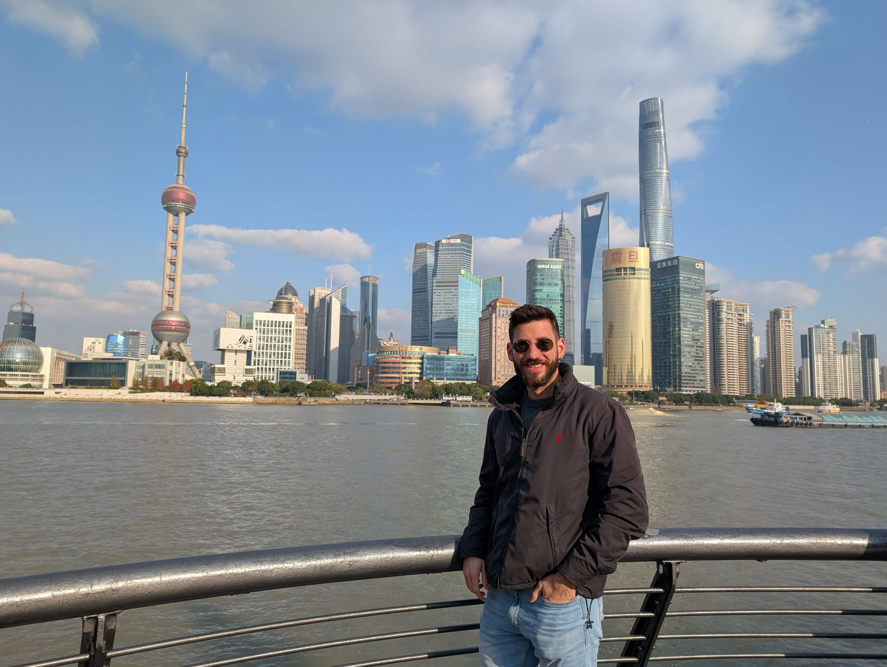

::: {.about-container}

::: {.about-header}
::: {.about-profile}
{.about-profile-img style="border-radius: 0;"}
:::

::: {.about-intro}
# Dimitrios Mallios

::: {.about-location}
📍 London, United Kingdom
:::

::: {.about-bio}
Hi, I’m Dimitrios, and this is my personal space.

I’m a Machine Learning Engineer with a background in Computer Engineering (MEng) and Artificial Intelligence (MSc). I’ve built AI applications across both industry and academia, working on various AI fields, from computer vision to large language models, vision-language models, autonomous agents and model compression.

What excites me most is incubating new ideas and shaping them into real products. Along the way, I’ve published several research papers and contributed to open-source projects.

At the moment I work at Applied Sciences Group in Microsoft re-shaping the windows platform bringing to users the AI they need to be productive.

Connect with me on [LinkedIn](https://linkedin.com/in/dimitris-mallios) and [X](https://twitter.com/dimi_Mall). 
:::

:::
:::

:::